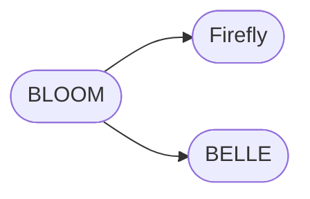
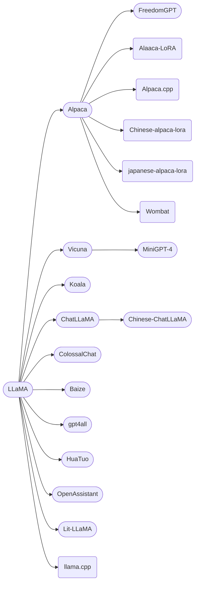
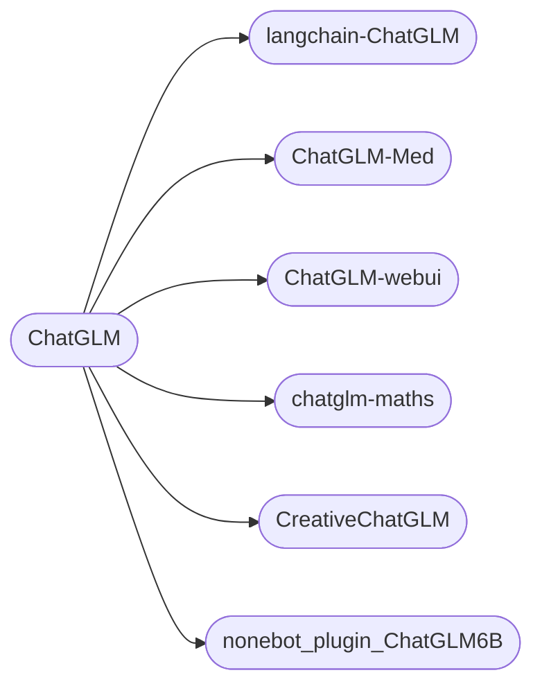

+++
author = "SWHL"
title = "LLM梳理"
date = "2023-04-15"
description = "梳理已有LLM项目"
tags = ["llm"]
+++

### 引言
- 当前LLM模型火出天际，但是做事还是需要脚踏实地。
- 此文只是日常学习LLM，顺手整理所得。
- 本篇博文更多侧重对话、问答类LLM上，其他方向（代码生成）这里暂不涉及，可以去看[综述](https://arxiv.org/pdf/2303.18223)来了解。

### 之前LLM模型梳理
- 图来源： [A Survey of Large Language Models](https://arxiv.org/pdf/2303.18223) | [Github Repo](https://github.com/RUCAIBox/LLMSurvey)

### [BLOOM](https://huggingface.co/bigscience/bloom) （BigScience）
- BLOOM是一个自回归的大模型，可根据prompt来生成连续的文本。包括46种语言和13个编程语言。
- 参数量为1760亿个参数。和GPT一样，使用的是`decoder-only`架构。
- 训练所用数据集基本是手搓出来的。
- 但是要想推理起来这个模型，起码需要8个A800 80G的显卡才能推理起来。小编前不久有幸推理了一下，模型将近就有328G，真是够大的。
- 这个模型要想落地，可就需要很长一段时间了。

### 后BLOOM模型梳理

#### [LLaMA](https://github.com/facebookresearch/llama) (Meta)
- 缺乏指令微调

#### 后LLaMA模型整理

#### [llama.cpp](https://github.com/ggerganov/llama.cpp)
在纯C/C++中推断LLaMA模型，支持LLaMA，Alpaca，GPT4All和Vicuna

### [Alpaca](https://github.com/tatsu-lab/stanford_alpaca) (斯坦福)
- 由Meta的LLaMA 7B微调而来，52k数据，性能约等于GPT-3.5
- 由**Self-Instruct: Aligning Language Model with Self Generated Instructions**论文启发，使用现有强语言模型自动生成指令数据
- 衍生项目：
   - [Alpaca-LoRA](https://github.com/tloen/alpaca-lora): 开启了LLaMA模型上LoRA微调
   - [Alpaca.cpp](https://github.com/antimatter15/alpaca.cpp): 在自己设备上本地运行类似 ChatGPT 的快速模型
   - [Chinese-LLaMA-Alpaca](https://github.com/ymcui/Chinese-LLaMA-Alpaca) 
   - [Chinese-alpaca-lora](https://github.com/LC1332/Chinese-alpaca-lora)
   - [japanese-alpaca-lora](https://github.com/masa3141/japanese-alpaca-lora)
   - [Wombat](https://github.com/GanjinZero/RRHF#wombat-build-your-own-chatbot): 提出无需强化学习的对齐方法训练语言模型
### [Vicuna](https://github.com/lm-sys/FastChat) (UC伯克利、卡内基梅隆大学、斯坦福大学和加州大学圣地亚哥分校)
- 与GPT-4性能相匹配的LLaMA微调版本， 130亿参数
- 通过在ShareGPT收集用户共享对话对LLaMA进行微调而来，在超过90%的情况下，实现了与Bard和ChatGPT相匹配的能力

### 三者之间汇总对比

### [MiniGPT-4](https://github.com/Vision-CAIR/MiniGPT-4)
- 结合BLIP和Vicuna两个模型能力，可以对给定图像作chat

### [Koala](https://github.com/young-geng/EasyLM) (UC伯克利 AI Research Institute（BAIR）)
- 使用网络获取的高质量数据进行训练，可以有效地回答各种用户的查询，比Alpaca更受欢迎，至少在一半的情况下与ChatGPT的效果不相上下
- 得出有效结论：**正确的数据可以显著改善规模更小的开源模型**
- 研究人员专注于收集一个小型的高质量数据集，包括ChatGPT蒸馏数据、开源数据等
### [ChatLLaMA](https://github.com/nebuly-ai/nebullvm/tree/main/apps/accelerate/chatllama) (Nebuly)
- 一个可以使用自己的数据和尽可能少的计算量，来创建个性化的类似ChatGPT的对话助手
- 库的目的是通过抽象计算优化和收集大量数据所需的工作，让开发人员高枕无忧
- ChatLLaMA旨在帮助开发人员处理各种用例，所有用例都与RLHF训练和优化推理有关。以下是一些用例参考：
   - 为垂直特定任务（法律、医疗、游戏、学术研究等）创建类似ChatGPT的个性化助手；
   - 想在本地硬件基础设施上使用有限的数据，训练一个高效的类似ChatGPT的助手；
   - 想创建自己的个性化版本类ChatGPT助手，同时避免成本失控；
   - 想了解哪种模型架构（LLaMA、OPT、GPTJ等）最符合我在硬件、计算预算和性能方面的要求；
   - 想让助理与我的个人/公司价值观、文化、品牌和宣言保持一致。
### [Chinese-ChatLLaMA](https://github.com/ydli-ai/Chinese-ChatLLaMA)（ydli-ai）
- 中文对话模型ChatLLaMA、中文基础模型LLaMA-zh。
-ChatLLaMA 支持简繁体中文、英文、日文等多语言。
- LLaMA 在预训练阶段主要使用英文，为了将其语言能力迁移到中文上，首先进行中文增量预训练，
- 使用的语料包括[中英平行语料](https://statmt.org/wmt18/translation-task.html#download)、[中文维基、社区互动、新闻数据](https://github.com/CLUEbenchmark/CLUECorpus2020)、[科学文献](https://github.com/ydli-ai/CSL)等。再通过 [Alpaca 指令微调](https://github.com/tatsu-lab/stanford_alpaca)得到 Chinese-ChatLLaMA。
- **项目特点**
  + 通过 Full-tuning （全参数训练）获得中文模型权重，提供 TencentPretrain 与 HuggingFace 版本
  + 模型细节公开可复现，提供数据准备、模型训练和模型评估完整流程代码
  + 提供目前最大的中文 LLaMA 模型
  + 多种量化方案，支持 CUDA 和边缘设备部署推理

### [FreedomGPT](https://github.com/ohmplatform/FreedomGPT) (Age of AI)
- 建立在Alpaca之上，回答问题没有偏见或偏袒，并且会毫不犹豫第回答有争议或争论性的话题
- 克服了审查限制，在没有任何保障的情况下迎合有争议性的话题。标志是自由女神像，象征自由。
### [ColossalChat](https://github.com/hpcaitech/ColossalAI/tree/main/applications/Chat/coati) (UC伯克利)
- 基于LLaMA模型，只需不到100亿个参数就能达到中英文双语能力，效果与ChatGPT和GPT3.5相当。
- 复刻了完整的RLHF过程，是目前最接近ChatGPT原始技术路线的开源项目
- 使用了[InstrutionWild](https://github.com/XueFuzhao/InstructionWild)中英双语训练数据集，其中包含大约100,000个中英文问答对。
    - 该数据集是从社交媒体平台上的真实问题场景中收集和清理的，作为种子数据集，使用self-instruct进行扩展，标注成本约为900美元。
    - 与其他self-instruct方法生成的数据集相比，该数据集包含更真实和多样化的种子数据，涵盖更广泛的主题。该数据集适用于微调和RLHF训练。
    - 在提供优质数据的情况下，ColossalChat可以实现更好的对话交互，同时也支持中文。
- 完整的RLHF管线，共有三个阶段：
   1. RLHF-Stage1: 使用上述双语数据集进行监督指令微调模型
   2. RLHF-Stage2: 通过对同一提示的不同输出手动排序来训练奖励模型，分配相应的分数，然后监督奖励模型的训练
   3. RLHF-Stage3: 使用强化学习算法，这是训练过程中最复杂的部分。
### [Baize](https://github.com/project-baize/baize-chatbot) （加州大学圣迭戈分校、中山大学和微软亚研）
- 包括四种英文模型（白泽-7B、13B、30B）和一个垂直领域的白泽医疗模型，计划未来发布中文的白泽模型。
- 值得注意的是，**该方法的数据处理、训练模型、Demo等全部代码均已开源，真是良心，由衷点赞。**
- 作者提出一种自动收集ChatGPT对话的流水线，通过从特定数据集中采样[种子]的方式，让ChatGPT自我对话，批量生成高质量多轮对话数据集。如果使用特定领域数据集，比如医学问答数据集，就可以生成高质量垂直领域语料。

    
### [gpt4all](https://github.com/nomic-ai/gpt4all)（Nomic AI）
- 基于GPT-3.5-Turbo的800k条数据进行训练，包括文字问题、故事描述、多轮对话和代码。
- 该方案提供了完整的技术报告，包括收集数据、整理数据、训练代码和模型权重。

### [Huatuo-Llama-Med-Chinese](https://github.com/SCIR-HI/Huatuo-Llama-Med-Chinese)（哈工大）

### [OpenAssistant](https://github.com/LAION-AI/Open-Assistant) (LAION-AI)
- 一种基于聊天的助手，可以理解任务，可以与第三方系统交互，并动态检索信息。

### [Lit-LLaMA](https://github.com/Lightning-AI/lit-llama) (Lightning-AI) 
- 基于nanoGPT的LLaMA的独立实现

### [ChatYuan-large-v2](https://github.com/clue-ai/ChatYuan) （元语智能）
- 这个模型的商业气息较浓一些。不过，这也是无奈之举。
- ChatYuan-large-v2是一个支持中英双语的功能型对话语言大模型。ChatYuan-large-v2使用了和 v1版本相同的技术方案，在微调数据、人类反馈强化学习、思维链等方面进行了优化。
- ChatYuan-large-v2是ChatYuan系列中以轻量化实现高质量效果的模型之一，用户可以在消费级显卡、 PC甚至手机上进行推理（INT4 最低只需 400M ）。

### [Firefly](https://github.com/yangjianxin1/Firefly)（yangjianxin1）
- Firefly（流萤） 是一个开源的中文对话式大语言模型，基于BLOOM模型，使用指令微调（Instruction Tuning）在中文数据集上进行调优。同时使用了词表裁剪、ZeRO、张量并行等技术，有效降低显存消耗和提高训练效率。 在训练中，使用了更小的模型参数量，以及更少的计算资源。构造了许多与中华文化相关的数据，以提升模型这方面的表现，如对联、作诗、文言文翻译、散文、金庸小说等。
- 因为该项目首先采用[LLMPrunner](https://github.com/yangjianxin1/LLMPruner)对原始BLOOM模型进行此表裁剪，所以效果有限，优势在于小，缺点也在这里。

### [BELLE](https://github.com/LianjiaTech/BELLE) （链家）
- 本项目重点关注在开源预训练大语言模型的基础上，如何得到一个尽可能效果好的具有指令表现能力的语言模型，降低大家研究此方面工作的门槛，重点在于中文大语言模型。
- 针对中文做了优化，模型调优仅使用了由ChatGPT生产的数据（不包含任何其他数据）
- 调优BLOOMZ-7B1-mt模型，开放了四个不同大小规模的指令学习数据集训练模型

  | Datasize| 200,000 | 600,000 | 1,000,000 | 2,000,000 |
  | :-----: | :-----: | :-----: | :-----: | :-----: |
  | Finetuned Model | [BELLE-7B-0.2M](https://huggingface.co/BelleGroup/BELLE-7B-0.2M) | [BELLE-7B-0.6M](https://huggingface.co/BelleGroup/BELLE-7B-0.6M) | [BELLE-7B-1M](https://huggingface.co/BelleGroup/BELLE-7B-1M) | [BELLE-7B-2M](https://huggingface.co/BelleGroup/BELLE-7B-2M) |
* 基于[Meta LLaMA](https://github.com/facebookresearch/llama)实现调优的模型：[BELLE-LLaMA-7B-0.6M-enc](https://huggingface.co/BelleGroup/BELLE-LLaMA-7B-0.6M-enc)
, [BELLE-LLaMA-7B-2M-enc](https://huggingface.co/BelleGroup/BELLE-LLaMA-7B-2M-enc)
, [BELLE-LLaMA-7B-2M-gptq-enc](https://huggingface.co/BelleGroup/BELLE-LLaMA-7B-2M-gptq-enc)
, [BELLE-LLaMA-13B-2M-enc](https://huggingface.co/BelleGroup/BELLE-LLaMA-13B-2M-enc)。请参考[Meta LLaMA的License](https://github.com/facebookresearch/llama/blob/main/LICENSE)
- 值得说明的是，该项目开源了一批由ChatGPT生成的中文数据集，具体如下：
  - [1.5M中文数据集](https://github.com/LianjiaTech/BELLE/tree/main/1.5M)：包含不同指令类型、不同领域的子集。
  - [10M中文数据集](https://github.com/LianjiaTech/BELLE/tree/main/10M)，包括25w条中文数学题数据、80w条用户与助手对话数据、40w条给定角色的多轮对话数据、200w条多样化指令任务数据。
- ⚠️ 数据集开源协议均为GPL3.0，使用请注意。

### [ChatGLM-6B](https://github.com/THUDM/ChatGLM-6B) （清华）

### [GLM-130B](https://github.com/THUDM/GLM-130B)（清华）

### ChatGLM周边梳理

### [ChatGLM-webui](https://github.com/Akegarasu/ChatGLM-webui)
### [chatglm-maths](https://github.com/yongzhuo/chatglm-maths): 数学微调
### [CreativeChatGLM](https://github.com/ypwhs/CreativeChatGLM): 续写工具
### [nonebot_plugin_ChatGLM6B](https://github.com/QNLanYang/nonebot_plugin_ChatGLM6B): 基于chatglm的nonebot实现
### [langchain-ChatGLM](https://github.com/imClumsyPanda/langchain-ChatGLM) （[imClumsyPanda](https://github.com/imClumsyPanda)）
- 该项目是基于本地知识的ChatGLM应用实现。基于本地文档类知识来增强ChatGLM的回答。这应该是最能落地的项目了。
- 整体流程如下图：

  

### [Med-ChatGLM](https://github.com/SCIR-HI/Med-ChatGLM)（哈工大）
---
### [Dolly 2.0](https://huggingface.co/databricks/dolly-v2-12b) （[databricks](https://huggingface.co/databricks)）

### [IDPChat](https://github.com/BaihaiAI/IDPChat) （白海）
- 中文多模态模型，基于预训练大模型LLaMA和开源文生图预训练模型Stable Diffusion为基础，快速构建而来。
- 开发者可以根据场景需求，便捷地对其进行微调优化。

### [StableLM](https://github.com/Stability-AI/StableLM) (Stability-AI)
- 发布这个模型的公司与发布Stable Diffusion模型是同一个公司
- Stable LM的发布建立在EleutherAI(一个非营利性研究中心)开源早期语言模型之上的。包括GPT-J、GPT-NeoX和Pythia套件，这些模型是在 The Pile开源数据集上进行训练的(许多最近开源的大语言模型也用它训练的，包括Cerebras-GPT和Dolly-2。)
- Stable LM是在The Pile的基础上建立的，但规模是它的三倍，包含1.5万亿条清洗、标注过的数据。官方将在适当的时候公布有关数据集的详细信 息。尽管其规模只有30亿到70亿个参数(相比之下，GPT-3有1750亿个参数)，但该数据集的丰富性使得Stable LM在对话和编码任务中表现出惊 人的高性能。
- Stability AI还发布了一组经过指令微调的研究模型。这些微调模型使用的是最近的开源数据集的组合:Alpaca、GPT4All、Dolly、ShareGPT和 HH。这些微调模型仅用于研究目的，并根据斯坦福大学的Alpaca许可证发布，遵守非商业CC BY-NC-SA 4.0许可证。

### [WebLLM](https://mlc.ai/web-llm/)（陈天奇团队）
- 基于LLM的类ChatGPT也能引进来，而且还是不需要服务器支持、WebGPU加速

### [MOSS](https://github.com/OpenLMLab/MOSS) (复旦大学自然语言处理实验室)
- MOSS是一个支持中英双语和多种插件的开源对话语言模型，moss-moon系列模型具有160亿参数，在FP16精度下可在单张A100/A800或两张 3090显卡运行，在INT4/8精度下可在单张3090显卡运行。MOSS基座语言模型在约七千亿中英文以及代码单词上预训练得到，后续经过对话指令 微调、插件增强学习和人类偏好训练具备多轮对话能力及使用多种插件的能力。
- 开源了模型和数据。但是还没有出相关的论文或技术报告。

### [UltraChat](https://github.com/thunlp/UltraChat)（清华thunlp）
- 该项目旨在构建一个开源、大规模、多轮的基于 Turbo APIs 的对话数据，方便研究者开发具有通用对话能力的强大语言模型。 此外，考虑到隐私保护等因素，该项目不会直接使用互联网上的数据作为提示。
- 为了确保生成数据质量，研究者在生成过程中采用了两个独立的 ChatGPT Turbo API，其中一个模型扮演用户角色来生成问题或指令，另一个模型 生成反馈。 
- 这个项目类似于Baize项目，但是比白泽生成的数据样式更加多样。白泽是基于种子对话和问题生成的，而UltraChat进行了细致的提示工程设计。

### [Big Bang Transformer乾元](https://bbt.ssymmetry.com/model.html) （超对称技术公司）
- [超对称联合复旦大学发布并开源120亿参数语言模型BBT-2](https://mp.weixin.qq.com/s/J6RcdoKdsOyOtqUkg6GTnA)

### [Cerebras](https://huggingface.co/cerebras)
- [免费可商用开源GPT模型问世，50G权重直接下载，性能不输GPT-3](https://www.thepaper.cn/newsDetail_forward_22548813)

### 参考资料

- [开发者笑疯了！ LLaMa惊天泄露引爆ChatGPT平替狂潮，开源LLM领域变天](https://mp.weixin.qq.com/s/kjzRzoUenP0NYa1A9lS7Aw)
- [训练ChatGPT的必备资源：语料、模型和代码库完全指南](https://mp.weixin.qq.com/s/6enOkW7pZsMeTpc4SODwSQ)
- [用ChatGPT训练羊驼：「白泽」开源，轻松构建专属模型，可在线试玩
](https://mp.weixin.qq.com/s/zxElGfclNbBwTuDG4Qrxnw)
- [笔记本就能运行的ChatGPT平替来了，附完整版技术报告](https://mp.weixin.qq.com/s/crpG4dtfQFe3Q7hR3oeyxQ)
- [世界首款真开源类ChatGPT大模型Dolly 2.0，可随意修改商用](https://www.thepaper.cn/newsDetail_forward_22684408)
- [中文多模态模型问世！IDPChat生成图像文字，只需5步+单GPU](https://mp.weixin.qq.com/s/xTMngVzg7URzCpErirTpzg)

