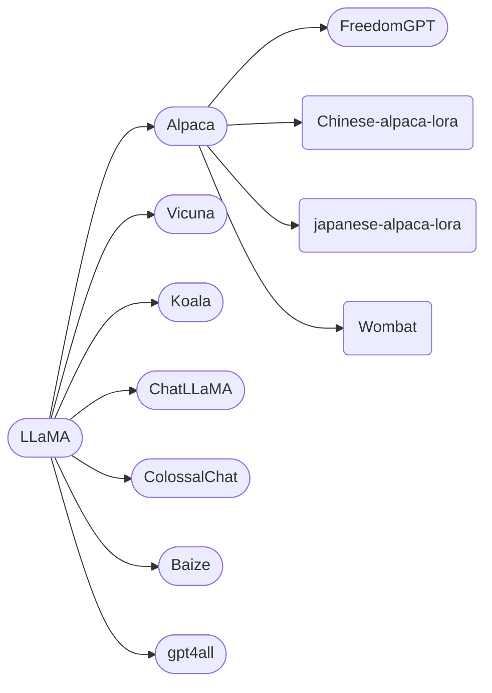

+++
author = "SWHL"
title = "LLM梳理"
date = "2023-04-15"
description = "梳理已有LLM项目"
tags = ["llm"]
+++

### 引言
- 当前LLM模型火出天际，但是做事还是需要脚踏实地。
- 此文只是日常学习LLM，顺手整理所得。
- 本篇博文更多侧重对话、问答类LLM上，其他方向（代码生成）这里暂不涉及，可以去看[综述](https://arxiv.org/pdf/2303.18223)来了解。

### 之前LLM模型梳理
- 图来源： [A Survey of Large Language Models](https://arxiv.org/pdf/2303.18223) | [Github Repo](https://github.com/RUCAIBox/LLMSurvey)

### [BLOOM](https://huggingface.co/bigscience/bloom) （BigScience）

### 后LLaMA模型梳理

### [LLaMA](https://github.com/facebookresearch/llama) (Meta)
- 缺乏指令微调
### [Alpaca](https://github.com/tatsu-lab/stanford_alpaca) (斯坦福)
- 由Meta的LLaMA 7B微调而来，52k数据，性能约等于GPT-3.5
- 由**Self-Instruct: Aligning Language Model with Self Generated Instructions**论文启发，使用现有强语言模型自动生成指令数据
- 衍生项目：
   - [alpaca-lora](https://github.com/tloen/alpaca-lora)
   - [Chinese-alpaca-lora](https://github.com/LC1332/Chinese-alpaca-lora)
   - [japanese-alpaca-lora](https://github.com/masa3141/japanese-alpaca-lora)
   - [Wombat](https://github.com/GanjinZero/RRHF#wombat-build-your-own-chatbot)
       - 提出无需强化学习的对齐方法训练语言模型
### [Vicuna](https://github.com/lm-sys/FastChat) (UC伯克利、卡内基梅隆大学、斯坦福大学和加州大学圣地亚哥分校)
- 与GPT-4性能相匹配的LLaMA微调版本， 130亿参数
- 通过在ShareGPT收集用户共享对话对LLaMA进行微调而来，在超过90%的情况下，实现了与Bard和ChatGPT相匹配的能力

- 训练流程：

### 三者之间汇总对比

### [Koala](https://github.com/young-geng/EasyLM) (UC伯克利 AI Research Institute（BAIR）)
- 使用网络获取的高质量数据进行训练，可以有效地回答各种用户的查询，比Alpaca更受欢迎，至少在一半的情况下与ChatGPT的效果不相上下
- 得出有效结论：**正确的数据可以显著改善规模更小的开源模型**
- 研究人员专注于收集一个小型的高质量数据集，包括ChatGPT蒸馏数据、开源数据等
### [ChatLLaMA](https://github.com/nebuly-ai/nebullvm/tree/main/apps/accelerate/chatllama) (Nebuly)
- 一个可以使用自己的数据和尽可能少的计算量，来创建个性化的类似ChatGPT的对话助手
- 库的目的是通过抽象计算优化和收集大量数据所需的工作，让开发人员高枕无忧
- ChatLLaMA旨在帮助开发人员处理各种用例，所有用例都与RLHF训练和优化推理有关。以下是一些用例参考：
   - 为垂直特定任务（法律、医疗、游戏、学术研究等）创建类似ChatGPT的个性化助手；
   - 想在本地硬件基础设施上使用有限的数据，训练一个高效的类似ChatGPT的助手；
   - 想创建自己的个性化版本类ChatGPT助手，同时避免成本失控；
   - 想了解哪种模型架构（LLaMA、OPT、GPTJ等）最符合我在硬件、计算预算和性能方面的要求；
   - 想让助理与我的个人/公司价值观、文化、品牌和宣言保持一致。
### [FreedomGPT](https://github.com/ohmplatform/FreedomGPT) (Age of AI)
- 建立在Alpaca之上，回答问题没有偏见或偏袒，并且会毫不犹豫第回答有争议或争论性的话题
- 克服了审查限制，在没有任何保障的情况下迎合有争议性的话题。标志是自由女神像，象征自由。
### [ColossalChat](https://github.com/hpcaitech/ColossalAI/tree/main/applications/Chat/coati) (UC伯克利)
- 基于LLaMA模型，只需不到100亿个参数就能达到中英文双语能力，效果与ChatGPT和GPT3.5相当。
- 复刻了完整的RLHF过程，是目前最接近ChatGPT原始技术路线的开源项目
- 发布了中英双语训练数据集，其中包含大约100,000个中英文问答对。
    - 该数据集是从社交媒体平台上的真实问题场景中收集和清理的，作为种子数据集，使用self-instruct进行扩展，标注成本约为900美元。
    - 与其他self-instruct方法生成的数据集相比，该数据集包含更真实和多样化的种子数据，涵盖更广泛的主题。该数据集适用于微调和RLHF训练。
    - 在提供优质数据的情况下，ColossalChat可以实现更好的对话交互，同时也支持中文。
- 完整的RLHF管线，共有三个阶段：
   1. RLHF-Stage1: 使用上述双语数据集进行监督指令微调模型
   2. RLHF-Stage2: 通过对同一提示的不同输出手动排序来训练奖励模型，分配相应的分数，然后监督奖励模型的训练
   3. RLHF-Stage3: 使用强化学习算法，这是训练过程中最复杂的部分。
### [Baize](https://github.com/project-baize/baize-chatbot) （加州大学圣迭戈分校、中山大学和微软亚研）
- 包括四种英文模型（白泽-7B、13B、30B）和一个垂直领域的白泽医疗模型，计划未来发布中文的白泽模型。
- 值得注意的是，**该方法的数据处理、训练模型、Demo等全部代码均已开源，真是良心，由衷点赞。**
- 作者提出一种自动收集ChatGPT对话的流水线，通过从特定数据集中采样[种子]的方式，让ChatGPT自我对话，批量生成高质量多轮对话数据集。如果使用特定领域数据集，比如医学问答数据集，就可以生成高质量垂直领域语料。

    
### [gpt4all](https://github.com/nomic-ai/gpt4all)（Nomic AI）
- 基于GPT-3.5-Turbo的800k条数据进行训练，包括文字问题、故事描述、多轮对话和代码。
- 该方案提供了完整的技术报告，包括收集数据、整理数据、训练代码和模型权重。
---
### [ChatYuan-large-v2](https://github.com/clue-ai/ChatYuan) （元语智能）
- 这个模型的商业气息较浓一些。不过，这也是无奈之举。
- ChatYuan-large-v2是一个支持中英双语的功能型对话语言大模型。ChatYuan-large-v2使用了和 v1版本相同的技术方案，在微调数据、人类反馈强化学习、思维链等方面进行了优化。
- ChatYuan-large-v2是ChatYuan系列中以轻量化实现高质量效果的模型之一，用户可以在消费级显卡、 PC甚至手机上进行推理（INT4 最低只需 400M ）。

### [Firefly](https://github.com/yangjianxin1/Firefly)（yangjianxin1）
- Firefly（流萤） 是一个开源的中文对话式大语言模型，使用指令微调（Instruction Tuning）在中文数据集上进行调优。同时使用了词表裁剪、ZeRO、张量并行等技术，有效降低显存消耗和提高训练效率。 在训练中，使用了更小的模型参数量，以及更少的计算资源。构造了许多与中华文化相关的数据，以提升模型这方面的表现，如对联、作诗、文言文翻译、散文、金庸小说等。
- 因为该项目首先采用[LLMPrunner](https://github.com/yangjianxin1/LLMPruner)对原始BLOOM模型进行此表裁剪，所以效果有限，优势在于小，缺点也在这里。

### [BELLE](https://github.com/LianjiaTech/BELLE) （链家）

### [ChatGLM-6B](https://github.com/THUDM/ChatGLM-6B) （清华）

### [langchain-ChatGLM](https://github.com/imClumsyPanda/langchain-ChatGLM) （[imClumsyPanda](https://github.com/imClumsyPanda)）
- 该项目是基于本地知识的ChatGLM应用实现。基于本地文档类知识来增强ChatGLM的回答。这应该是最能落地的项目了。
- 整体流程如下图：

  

### [Dolly 2.0](https://huggingface.co/databricks/dolly-v2-12b) （[databricks](https://huggingface.co/databricks)）

### 参考资料

- [开发者笑疯了！ LLaMa惊天泄露引爆ChatGPT平替狂潮，开源LLM领域变天](https://mp.weixin.qq.com/s/kjzRzoUenP0NYa1A9lS7Aw)
- [训练ChatGPT的必备资源：语料、模型和代码库完全指南](https://mp.weixin.qq.com/s/6enOkW7pZsMeTpc4SODwSQ)
- [用ChatGPT训练羊驼：「白泽」开源，轻松构建专属模型，可在线试玩
](https://mp.weixin.qq.com/s/zxElGfclNbBwTuDG4Qrxnw)
- [笔记本就能运行的ChatGPT平替来了，附完整版技术报告](https://mp.weixin.qq.com/s/crpG4dtfQFe3Q7hR3oeyxQ)
- [世界首款真开源类ChatGPT大模型Dolly 2.0，可随意修改商用](https://www.thepaper.cn/newsDetail_forward_22684408)

