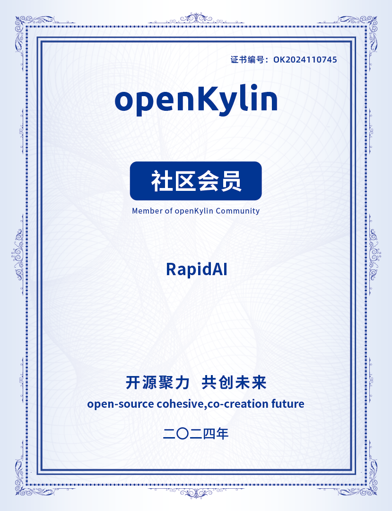
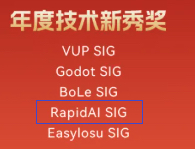

RapidAI于近日加入openKylin社区，共建openKylin社区生态。

巧的是，进入之季正好赶上2024年openKylin社区贡献者荣耀征集，于是就报了名。幸运的是，RapidAI获得了：**2024年度技术新秀奖**。（官方通告[链接](https://mp.weixin.qq.com/s/TwWVz19CX0egOlxgUv-OEQ)）

openKylin（开放麒麟） 社区是由基础软硬件企业、非营利性组织、社团组织、高等院校、科研机构和个人开发者共同创立的一个开源社区，旨在以“共创”为核心、以“开源聚力、共创未来”为社区理念，在开源、自愿、平等、协作的基础上，通过开源、开放的方式与企业构建合作伙伴生态体系，共同打造桌面操作系统顶级社区，推动Linux 开源技术及其软硬件生态繁荣发展。

openKylin官网：<https://www.openkylin.top/>
