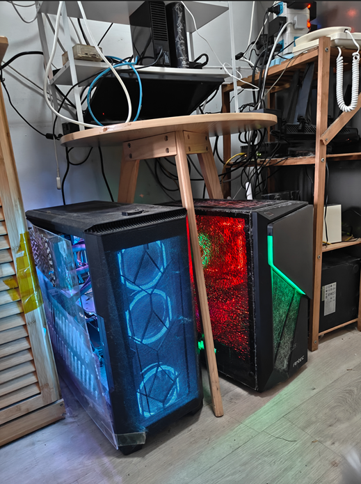

## RapidAI Research

Welcome to RapidAI Research Institute (RapidAI Research)

RapidAI Research Institute is an academic institution under the RapidAI open-source organization. The Chinese name is: Jie Zhi Technology Research Institute.

### RapidAI Research Recruits Remote Visiting Students (Long-term Valid)

Recruitment:\
We are recruiting students in the second semester of their second year of undergraduate studies (outstanding students may be relaxed to the first semester of their third year) to join our group for a visit. We provide paper guidance and computational resources to assist in publishing papers. If interested, please contact the email: <admissions@rapidai.tech>.

### Latest News

The latest accepted paper by RapidAI Research.

For papers published by researchers of this institute, the second author's affiliation is marked as **RapidAI Research**, with the email suffix **@rapidai.tech**. Permanent email services are provided for all members with the qualification of level 7 associate researcher or above, facilitating long-term academic exchanges with peers.

The following is an archival photo of the first-generation IDC center of this institute for commemoration:\
IDC Configuration:\
1000M internet access, dual GPUs (4090 & 6000 ADA), 50T storage space.

### Management Team (Members to be determined, to be announced after the official establishment of the institute)

- Honorary Dean: (Peking University Professor, Yangtze River Scholar)
- Executive Dean: Ma Yong (znsoft)
- Chief Scientist: Pending
- Engineering Director: Wang Jiahua

### Academic Committee

#### Membership Rules

- Students from Dannybo Academic Institutions automatically become probationary researchers of this institute.
- Graduate students of the China Excellent Engineer Program automatically become probationary researchers.
- Graduate students from Beijing Institute of Technology/Beijing University of Posts and Telecommunications guided by mentors of this institute automatically become probationary researchers.
- After publishing a paper in a top journal or conference, one is promoted to level 7 associate researcher. Upon graduation with a master's degree (with two papers), one is promoted to level 6 associate researcher, and upon graduation with a doctoral degree, one is promoted to level 5 associate researcher.
