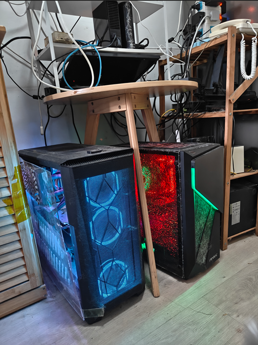

## RapidAI Research

欢迎访问 RapidAI研究院 (RapidAI Research)

RapidAI研究院为RapidAI开源组织下属学术机构，中文名：捷智技术研究院

### RapidAI Research 招募远程访问学生 （长期有效）

招募 \
大学本科2年级下学期学生（优秀学生可放宽到3年级上学期）进组访问，提供论文指导与计算资源，协助发表论文。有意联系邮箱：<admissions@rapidai.tech> 。

### 最新消息

RapidAI Research最新录用论文。→ [论文列表](paper.md)

本研究院研究员所发表论文，第二作者单位标注为 **RapidAI Research**， 邮箱后缀 **@rapidai.tech**，为所有7级副研究员或以上资格成员提供永久邮箱服务，便于与同行长期学术交流。\

下图为本研究院初代IDC中心存档图片，以示留念：\
IDC配置 \
1000M互联网接入，双GPU (4090 & 6000 ADA), 50T存贮空间。

### 管理团队 （待定成员，研究院正式成立后公布）

- 荣誉院长： (北大教授，长江学者）
- 执行院长：马勇 （znsoft)
- 首席科学家：Pending
- 工程总监：王佳华

### 学术委员会

#### 成员规则

- 丹尼博学术机构学员自动成为本研究院见习研究员。
- 中国卓越工程师计划硕博研究生自动成为见习研究员。
- 由本研究院导师指导的 北京理工大学/北京邮电大学 研究生，自动成为见习研究员。
- 发表完成一篇1区或顶会论文后，升任7级副研究员，硕士毕业（两篇文章）任升为6级副研究员，博士毕业升任5级副研究员。
